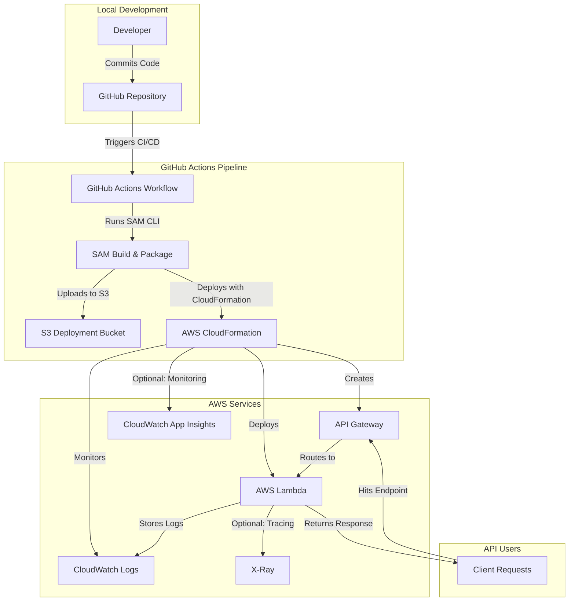

```mermaid
graph TD
subgraph Local Development
A[Developer] -->|Commits Code| B[GitHub Repository]
end

subgraph GitHub Actions Pipeline
B -->|Triggers CI/CD| C[GitHub Actions Workflow]
C -->|Runs SAM CLI| D[SAM Build & Package]
D -->|Uploads to S3| E[S3 Deployment Bucket]
D -->|Deploys with CloudFormation| F[AWS CloudFormation]
end

subgraph AWS Services
F -->|Creates| G[API Gateway]
F -->|Deploys| H[AWS Lambda]
F -->|Monitors| I[CloudWatch Logs]
H -->|Stores Logs| I
H -->|Optional: Tracing| J[X-Ray]
F -->|Optional: Monitoring| K[CloudWatch App Insights]
end

subgraph API Users
L[Client Requests] -->|Hits Endpoint| G
G -->|Routes to| H
H -->|Returns Response| L
end
```
